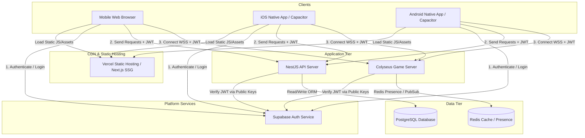
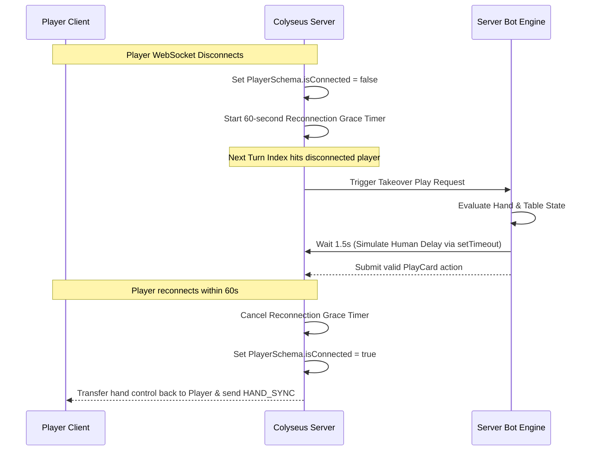

# MEGA MENDIKOT 5V5: MASTER SPECIFICATION BLUEPRINT

**Production-Ready Specification Suite for Executive & Design Director Review**  
**Document Version:** 1.3.1  
**Target Platforms:** Web (Desktop/Mobile Browsers), iOS, Android (via Capacitor)  
**Author:** Lead Technical Game Architect, Antigravity Studio

---

## Changes from 1.3.0

- **Turn timer updated to 20s.** §2.9 now specifies **20 seconds** per turn (was 15s) to reduce pressure and accommodate the larger 10-player table. The visible countdown ring was removed from the UI; the timer is now invisible to players (server-enforced auto-play only).
- **New §2.11 — Multiplayer Lobby & Matchmaking (Current Implementation).** Documents the shipped lobby system: Quick Match (auto-fill with bots), Private Rooms (4-char codes + shareable links), room registry, team-balancing seat assignment, and session-based reconnection.
- **New §2.12 — Deployment.** Documents the Render deployment: zero-dependency single process, single-port HTTP+WebSocket, `render.yaml` Blueprint, live at `https://mega-mindikot.onrender.com`.
- **§6.1 Scope Matrix updated** to reflect which MVP features are shipped vs. pending.

---

## Changes from 1.2.0

- **Single rank scale.** Removed the duplicate "Card Rank Value Matrix" from §2.7. The `CardSchema.rank` scale of `7–14` (7 = Seven … 10 = Ten … 14 = Ace) is now the sole authoritative card-strength scale. See §2.7.
- **Trump-declaration bot rules renumbered.** §4.3 heuristics are now **T-1 / T-2** (were T-3 / T-4) so bot rule numbering is contiguous with no gap.
- **Turn timer rules added to §2.** New **§2.9 Turn Timer & AFK Engine** owns the behavior the `GameState.turnTimeRemaining` field promises. Previously the schema referenced a mechanic that had no rule definition.
- **Lead-selection deck provenance clarified.** §2.4 now states the lead-selection cards are dealt from a **separate** shuffled selection deck (not the 192-card main deck) and discarded afterward.
- **Party → team → seat mapping added.** New **§2.10 Team & Seat Assignment** connects §3.5 party matchmaking to the §2.2 seating grid.
- **Kitty Ten → instant win made explicit.** §2.3.5 and §2.8 now state that a revealed kitty Ten counts toward the captured-Tens total and can trigger the immediate 13-Ten win at that trick's resolution.
- **Nits.** §2.4 tie-breaker now has a max-iterations cap with deterministic fallback; §2.6 states the lead player can never establish trump; §2.7 ties the "strength 0" discard language into the resolution steps; §6.2 dropped the dangling external `BOT_DESIGN.md` reference (§4 is the canonical, self-contained bot source).

---

## 1. Executive Summary & Core Pillars

### 1.1 Game Concept
**Mega Mindikot 5v5** is a massive-scale, team-based trick-taking card game inspired by the traditional Indian card game *Mendikot*. Pitting two teams of five players against each other in a high-stakes, fast-paced battle of communication, card counting, and tactical synchronization, it scales up traditional trick-taking mechanics for modern multiplayer platforms.

With 6 modified decks (192 cards total) in play, players must track duplicate cards, manage a dynamically established trump suit, coordinate plays in real time, and capture the valuable **10s** (Mendis) to win the match.

### 1.2 Core Pillars
1. **High-Fidelity Team Coordination**: Communication is the path to victory. With team-only voice/text chat, players coordinate high-low splits, establish trumps strategically, and sacrifice cards to secure tricks.
2. **Dynamic Tactical Depth**: The trump suit is not declared beforehand; it is established dynamically during play by the first player who cannot follow suit. This makes the early game highly volatile.
3. **The Duplicate Rule ("Last Wins")**: With six identical copies of every card in play, ties are common. The signature rule—**the last identical highest card played wins**—shifts the tactical advantage to players who act later in the rotation.
4. **Immediate-Win Objective**: There is no complex arithmetic or round-by-round point tallies. The game is a race to capture **13 out of the 24 Tens** in play. The moment a team reaches 13, they win instantly.

---

## 2. Game Setup & Ruleset Details

### 2.1 Symmetric Deck Configuration
To maintain perfect suit symmetry, the composite deck is built from **6 standard 52-card decks**, modified by retaining only specific card ranks. All four suits retain the same card ranks:

* **Cards Retained per Deck**: Ace (A), King (K), Queen (Q), Jack (J), Ten (10), Nine (9), Eight (8), Seven (7).
* **Cards Removed per Deck**: All 2s, 3s, 4s, 5s, 6s.

#### Mathematical Breakdown:
| Suit | Ranks Included | Cards per Deck | Total in 6 Decks |
| :--- | :--- | :--- | :--- |
| **Spades** (♠) | A, K, Q, J, 10, 9, 8, 7 | 8 | 48 |
| **Hearts** (♥) | A, K, Q, J, 10, 9, 8, 7 | 8 | 48 |
| **Diamonds** (♦) | A, K, Q, J, 10, 9, 8, 7 | 8 | 48 |
| **Clubs** (♣) | A, K, Q, J, 10, 9, 8, 7 | 8 | 48 |
| **TOTAL** | | **32** | **192** |

#### Card Rank Scale (Authoritative)
The single authoritative card-strengthcale is stored on every card as `rank`, an integer from **7 to 14**:

| Card | 7 | 8 | 9 | 10 | J | Q | K | A |
| :---: | :---: | :---: | :---: | :---: | :---: | :---: | :---: | :---: |
| `rank` | 7 | 8 | 9 | 10 | 11 | 12 | 13 | 14 |

Higher `rank` beats lower `rank`. No separate "power value" is used; all trick resolution, tie-breakers, and bot evaluations compare this `rank` directly.

### 2.2 Seating Arrangements
* **Total Players**: 10 (divided into Team A and Team B).
* **Seating Layout**: Alternating circular arrangement, ensuring every player sits between two opposing team members.

```
                  [0] Team A (A1)
         [9] Team B (B5)   [1] Team B (B1)
      [8] Team A (A5)         [2] Team A (A2)
      [7] Team B (B4)         [3] Team B (B2)
         [6] Team A (A4)   [4] Team A (A3)
                  [5] Team B (B3)
```

Seat parity is fixed: **even seats {0, 2, 4, 6, 8} → Team A**, **odd seats {1, 3, 5, 7, 9} → Team B**. Play proceeds clockwise in ascending seat index (modulo 10).

### 2.3 Dealing Phase & The 12-Card Kitty
* **Player Hands**: The 192-card deck is shuffled, and each player is dealt exactly **18 cards** face-down (180 cards total).
* **The 12-Card Kitty**: The remaining **12 cards** are placed face-down in the center of the table.

#### Kitty Distribution Rule (Option 3 - Method A)
To prevent unfair first-trick advantages and distribute rewards evenly, the 12 kitty cards are distributed trick-by-trick over the first 12 tricks of the match:
1. At the beginning of each of the first 12 tricks, the server places **one card from the kitty face-down** onto the table.
2. Players execute the trick normally, playing their cards without knowing what the face-down kitty card is.
3. Upon trick resolution, the server **reveals (flips face-up)** the kitty card to all players.
4. The winner of the trick captures the 10 trick cards plus the revealed kitty card into their team's capture pile.
5. **Kitty Tens count toward the win condition.** If the revealed kitty card is a Ten (Mendi), it is added immediately to the capturing team's Tens counter and counts toward the 13-Ten immediate-win threshold — see §2.8.

> **Capture arithmetic (verification).** Tricks 1–12 capture 11 cards each (10 played + 1 kitty); tricks 13–18 capture 10 cards each (played only). Total = 12×11 + 6×10 = 132 + 60 = **192**, accounting for every card in the deck.

### 2.4 Match Start (Lead Selection)
1. At the beginning of a match, the server builds a **separate, one-shuffled selection deck** (distinct from the 192-card main deck used for play) and deals **one card face-up** from it to each of the 10 players. This keeps the main-deck count intact (192 = 180 dealt + 12 kitty).
2. The player with the highest card rank is declared the **Lead Player** for the first trick. On the authoritative `rank` scale: **A (14) > K (13) > Q (12) > J (11) > 10 > 9 > 8 > 7**.
3. **Tie-Breaker Rule**: If two or more players tie for the highest rank (e.g., three players receive an Ace), another card is dealt face-up from the selection deck to *only the tied players*. This recursive process repeats until a single highest card determines the first lead.
   * **Recursion Cap**: The redraw is bounded at **20 iterations**. If a tie somehow persists past the cap (statistically negligible), the **lowest seat index** among the final tied set is declared the Lead Player as a deterministic fallback.
4. Once the lead player is established, the selection deck and all dealt selection cards are **discarded**; the main deck is **shuffled independently**, and the actual 18-card hands and 12-card kitty are established from it.

> **✨ AMENDMENT (v1.3.2, 2026-06-20):** Lead selection is now a **visible on-screen
> ceremony** that plays out *before* the main hand is dealt. The server runs a new
> transient `LEAD_SELECT` match state: cards flip face-up at each seat, tied seats
> redraw in "shootout" rounds (only the tied players), and the unique winner is
> highlighted before dealing begins. This visualizes §2.4 as specified — the rules
> above are unchanged; only the client/server *presentation* is new. Implementation:
> `runLeadSelectRound()` / `resolveLeadSelect()` in `game-room.js`.

### 2.5 Trick Rules & Turn Execution
* **Trick Structure**: A trick consists of one card played by each player in clockwise seating order (ascending seat index, modulo 10), starting with the lead player.
* **Following Suit**: The suit of the card played by the lead player is the **Lead Suit**. All subsequent players must play a card of the lead suit if they have one in their hand.
* **Off-Suit Play**: If a player does not have any cards of the lead suit, they may play a card of any other suit (off-suit card).

### 2.6 Dynamic Trump System
1. At the start of the match, **no trump suit exists** (No Trump state).
2. The **first player** who is unable to follow the lead suit and plays an off-suit card **permanently establishes** that off-suit's suit as the trump suit for the remainder of the match.
3. Only the first off-suit card establishes the trump. Once set, the trump suit is fixed and can never be changed for the rest of the match.

> **Note — the lead player can never establish trump.** Because the lead player's own card defines the lead suit, they are definitionally following it, so they can never be the off-suit declarer. Trump is always declared by one of seats 1–9.

### 2.7 Trick Resolution & Card Rank Matrix
The server evaluates the 10 played cards at the end of each trick using the following priority structure:
1. **Trump Suit Priority**: If one or more trump cards are played, the highest-ranking trump card (`rank`) wins. If there is a tie for the highest trump card, the **last identical highest trump card played** wins.
2. **Lead Suit Priority**: If no trump cards are played, the highest-ranking card (`rank`) of the lead suit wins the trick. If there is a tie, the **last identical highest card of the lead suit played** wins.
3. **Discard / Off-Suit Ineligibility**: Any card played that matches neither the lead suit nor the established trump suit is a discard. **Discards are simply ineligible to win the trick** — they are ignored entirely by steps 1 and 2 above and can never be selected as the winning card, regardless of their `rank`.

Card `rank` follows the authoritative scale in §2.1 (7 = lowest, 14 = Ace = highest). There is no separate power-value table.

### 2.8 Win Conditions & The 12-12 Deadlock
* **Immediate-Win**: The first team to capture **13 out of the 24 Tens** wins the match immediately. The match terminates, and players are routed to the post-game summary screen. This check runs at every trick resolution — including tricks where a revealed kitty Ten pushes a team to 13 (see §2.3.5).
* **The 12-12 Deadlock**: In the event of a 12-12 tie after all cards are played, the victory is awarded to the team that **captured the 18th and final trick** of the match. *(Because 24 Tens are always fully captured by match end and 13 is the win threshold, 12-12 is the only tie split mathematically possible — every other full-depletion split already produced a 13+ winner.)*

> **⚠️ AMENDMENT (v1.3.1, 2026-06-20):** The deadlock rule above is **superseded**.
> The tiebreaker is now **most tricks won**: on a 12-12 Ten tie after all 18 tricks,
> the team that captured the **most tricks** wins. If the trick count is also tied
> (9–9), the match ends in a **draw** (no winner). Implementation: `resolveDeadlock()`
> in `shared/rules.js`; per-team trick counter `tricksWon` tracked in `game-room.js`.
> Player-facing docs (`RULEBOOK.md`, tutorial) reflect the new rule; this spec text
> is retained as the historical "as-originally-designed" record.

### 2.9 Turn Timer & AFK Engine
To maintain multiplayer momentum across a 10-player table, an authoritative turn timer is enforced server-side. The `GameState.turnTimeRemaining` field (§3.3) is the network-visible surface of this engine.

* **Turn Duration**: **20 seconds** per active seat. The server decrements `turnTimeRemaining` once per second during the `PLAYING` state.
* **Invisible Timer**: The visible countdown ring was removed from the client UI. The timer is enforced server-side only — players see no on-screen countdown. The server still emits a turn-warning event at 5 seconds remaining (available for future UI/sound hooks), but the current client does not render it.
* **Auto-Play Rule (timer reaches 0)**: The server plays a card automatically for the active player using this deterministic order:
  1. If the player holds cards of the **Lead Suit**, play the **lowest `rank`** card of that suit.
  2. Else if the player cannot follow suit and **Trump is already established**, play the **lowest `rank` off-suit card excluding trumps** (to avoid wasting trumps).
  3. Else (cannot follow suit and Trump is NOT established), play the **lowest `rank` card of the suit they hold the most of** (minimizing the chance of accidentally declaring a weak trump).
* **AFK Flagging (Second Consecutive Timeout)**: If a single player times out **twice in a row**, they are flagged **AFK**. From that point, the server auto-plays their turns **instantly (0-second delay)** using the Auto-Play algorithm to avoid stalling the other 9 players. The client shows an overlay: *"You are marked as AFK. Tap here to resume control."* Any valid manual play by the player clears the AFK flag and resets the consecutive-timeout counter.

### 2.10 Team & Seat Assignment
Matchmaking forms two teams of five. A matched **party** (1–5 players queued together, see §3.5) is always placed onto **one team** and occupies that team's five seats:

* **Team A** → seats **{0, 2, 4, 6, 8}** (even seats).
* **Team B** → seats **{1, 3, 5, 7, 9}** (odd seats).

The matchmaker assigns each joining party a team and the specific seats within that team before the `MatchRoom` opens; the room must accept the team/seat assignment from the matchmaker payload rather than deriving it from client join order. Two parties (or party + solo fills) totaling 10 players always map cleanly to one full Team A and one full Team B.

### 2.11 Multiplayer Lobby & Matchmaking (Current Implementation)

> This section documents the **shipped** lobby system. The party/MMR/Redis matchmaking described in §3.5 remains the target for ranked play; the system below is the current production implementation.

The game supports real-time human multiplayer with bot fill via a room-based lobby system.

#### Quick Match
1. A player clicks **Quick Match** → the server finds an open room in `LOBBY` state with fewer than 10 humans (`findOpenRoom()`), or creates a new one.
2. The player is seated via `nextOpenSeat()` (see Seat Assignment below).
3. A **fill timer** (`FILL_TIMER_MS`, default 20000ms) starts when the first human joins. If the room doesn't fill to 10 humans before the timer expires, the remaining seats stay as bots and the match **auto-starts**. This ensures solo players always get a game without waiting indefinitely.
4. If the room fills to 10 humans before the timer, the host may start immediately.

#### Private Rooms
1. A player clicks **Create Private Room** → the server generates a **4-character room code** (ambiguous characters omitted: no `0`/`O`/`1`/`I`) and creates a private room.
2. The host sees the code and a **shareable link** (`https://<host>/?room=XXXX`).
3. Friends join by entering the code or opening the link. Private rooms **do not** auto-start — the host clicks **Start Game** manually (so friends have time to gather).
4. URL deep-linking: the client reads `?room=XXXX` from `location.search` and auto-fills the join code.

#### Room Registry
* The server maintains a `Map<roomId, GameRoom>` of all active rooms.
* Rooms in `LOBBY` state with **zero humans** are cleaned up after 30 seconds. Rooms in `FINISHED` state are cleaned up immediately.
* Each connection gets its own session; multiple browser tabs play independent matches.

#### Seat Assignment
Humans are seated by `nextOpenSeat()`, which:
1. Counts humans on each team.
2. Prefers the team with **fewer humans** (to balance teams as players join).
3. Within that team, picks the **lowest seat index** that is currently a bot.
Bots occupy all remaining seats. This produces balanced teams regardless of join order, and the game is always playable — even with just 1 human.

#### Reconnection
* Each client generates a persistent `sessionId` stored in `sessionStorage`.
* On disconnect, the seat is marked `isConnected = false` and a **60-second grace timer** starts. If the active seat belongs to the disconnected player, a bot takes over their turn.
* On reconnect (same `sessionId`), the server reclaims the original seat, cancels the grace timer, and re-syncs the full game state to the client (personalized hand + table state).

### 2.12 Deployment

The game is deployed as a **zero-dependency single Node.js process** on Render.

* **Runtime**: Node 18+ with no external dependencies (the WebSocket server is hand-implemented per RFC 6455 on top of `node:http` + `node:crypto`).
* **Binding**: The server binds `0.0.0.0` and reads `PORT` from the environment (`process.env.PORT`), making it container- and cloud-ready.
* **Single-Port Architecture**: HTTP (static client) and WebSocket (`/ws` upgrade path) share one port. This is reverse-proxy friendly — no separate WS port configuration needed.
* **Client Portability**: The client derives the WebSocket URL from `location.host` and auto-switches to `wss://` on HTTPS, so it works on any public domain without code changes.
* **Render Blueprint**: `render.yaml` in the repo root describes the service for one-click deployment (env: `NODE_VERSION`, `FILL_TIMER_MS`).
* **Live URL**: `https://mega-mindikot.onrender.com`
* **HTTPS & WebSocket**: Render provides TLS automatically; the `wss://` connection works out of the box.
* **Free Tier**: The free plan spins down after 15 minutes of inactivity (~30–50s cold start). The Starter plan ($7/mo) provides always-on.

> **Future services.** When auth, database, and chat are added, they layer onto this deployment: Render offers managed Postgres as a one-click add-on (`DATABASE_URL` env var), and the existing WebSocket protocol gains a `chat` message type that reuses the room's `broadcast()`. No restructuring of the single-server app is required.

---

## 3. Systems Architecture & Technical Design

### 3.1 Workspace Directory Structure
Mega Mindikot 5v5 uses a monorepo workspace architecture built with **Turborepo** to maximize code-sharing (especially game rules, interfaces, and network message types) across the frontend client, backend API, and multiplayer server.

```
mega-mindikot-monorepo/
├── apps/
│   ├── web/                 # Next.js App Router (UI Shell, Auth, Shop)
│   │   └── src/phaser/      # Phaser 3 Game Canvas & Assets
│   ├── backend/             # NestJS API (Supabase Token Verification, Matchmaking)
│   └── game-server/         # Colyseus Authority Server (WebSocket Rooms)
├── packages/
│   ├── shared/              # Shared types, MatchState enums, deck validators
│   └── database/            # Prisma Client & PostgreSQL Migrations
├── package.json
└── turbo.json
```

### 3.2 System Integration Diagram


### 3.3 Colyseus Game State Schema (`schema/GameState.ts`)
```typescript
import { Schema, MapSchema, ArraySchema, type } from "@colyseus/schema";
import { MatchState } from "@app/shared/MatchState";

export class CardSchema extends Schema {
  @type("string") id: string;
  @type("string") suit: string; // "SPADES" | "HEARTS" | "DIAMONDS" | "CLUBS"
  @type("number") rank: number; // 7 to 14 (7=lowest, 14=Ace). See §2.1.
  @type("string") ownerId: string; // sessionId
}

export class PlayerSchema extends Schema {
  @type("string") sessionId: string;
  @type("string") userId: string;
  @type("string") username: string;
  @type("string") team: string; // "A" | "B"
  @type("number") seatIndex: number; // 0 - 9
  @type("boolean") isReady: boolean = false;
  @type("boolean") isConnected: boolean = true;
  @type("number") cardsLeft: number = 18;

  // Hand is NOT exposed to Schema serialization to enforce Fog of War
  hand: CardSchema[] = [];
}

export class PlayedCardSchema extends Schema {
  @type("string") sessionId: string;
  @type(CardSchema) card: CardSchema;
  @type("number") playOrder: number;
}

export class TrickSchema extends Schema {
  @type("number") trickNumber: number;
  @type([PlayedCardSchema]) playedCards = new ArraySchema<PlayedCardSchema>();
  @type("string") leadSuit: string = "";
  @type("string") winnerSessionId: string = "";
}

export class GameState extends Schema {
  @type("string") matchState = MatchState.LOBBY;
  @type({ map: PlayerSchema }) players = new MapSchema<PlayerSchema>();

  @type("number") activeSeatIndex: number = -1;
  @type("string") trumpSuit: string = ""; // "SPADES" | "HEARTS" | "DIAMONDS" | "CLUBS" | ""
  @type("string") trumpDeclarerId: string = "";

  @type(TrickSchema) currentTrick = new TrickSchema();
  @type("number") kittyCardsLeft: number = 12; // Remaining kitty size
  @type(CardSchema) currentKittyCard: CardSchema; // Revealed face-up at trick resolution

  @type("number") teamATensCaptured: number = 0;
  @type("number") teamBTensCaptured: number = 0;
  @type("string") winningTeam: string = "";
  @type("number") turnTimeRemaining: number = 15; // Authoritative turn timer. Behavior defined in §2.9.
}
```

### 3.4 Security & Anti-Cheat Measures
1. **Server-Authoritative Fog of War**: The `PlayerSchema` class does *not* expose the player's `hand` array to broad room schema broadcasts. Hands are strictly synchronized with their respective clients using private, targeted WebSocket events. Opponent cards are sent as hidden counts (`cardsLeft`) until played.
2. **Network-Optimized Card IDs**: Ephemeral card IDs are generated dynamically per round as short, unique 4-character tokens (e.g. `card_0` to `card_179` or short hex strings) rather than heavy 64-byte SHA256 hashes. This reduces network payload sizes by over 90% while remaining secure, since the authoritative server validates card ownership before execution.
3. **Action Rate-Limiting**: A token-bucket rate limiter tracks messages using Redis (`INCR` with a 1-second TTL), rejecting players who exceed 3 actions per second.

### 3.5 Redis Architecture & Party Matchmaking
Redis manages high-speed ephemeral data, session states, and scaling properties:
* **Party Matchmaking**: When groups of up to 5 players queue, a Redis Hash is created (`party:id:<partyId> -> JSON list of userIds and MMRs`). The party ID is pushed to the Ranked Queue Sorted Set (`ZSET` key: `queue:ranked`) with the party's average MMR as the score. The matchmaking worker pulls party and solo entries within matching range windows, combining them to form teams of exactly 5. Each formed team is then assigned one side of the table per **§2.10** before the `MatchRoom` opens.
* **Presence Tracking**: Player online status heartbeats (`presence:user:<userId>`) are maintained in Redis with a 10-second TTL.
* **Session Recovery**: Stores player states during connection drops. Reconnection must occur within a 60-second grace period.

---

## 4. AI Bot Heuristics & Takeover Engine

Bots are hosted on the authoritative game server to act as casual lobby fillers or step in as **takeover agents** on client disconnect. The heuristics below are the single, self-contained definition of bot behavior.

### 4.1 Lead Heuristics
When a bot leads a trick, it selects a card based on the following deterministic hierarchy:
1. **Rule L-1 (Bleed Trumps)**: If Trump is established and the bot holds the Ace or King of Trump, lead it to draw out opponents' lower trumps while keeping team control.
2. **Rule L-2 (Bait Trump)**: If Trump is NOT established and the bot holds a "long suit" ($\ge 5$ cards), lead a low card (7 or 8) of that suit to bait an off-suit play from opponents.
3. **Rule L-3 (Lead Aces)**: If no long suits exist, lead the highest card of a non-trump suit (prioritizing Aces) to win the trick early.
4. **Rule L-4 (Discard/Weak Lead)**: If the bot only holds low-value cards, lead the lowest card of its weakest suit.

### 4.2 Follow-Suit Heuristics
When a bot is following a lead suit, it evaluates based on who is currently winning:
* **Teammate in Winning Position**:
  * **Rule F-1 (Save Power)**: Do not play a high card. Play the *lowest card of the lead suit* to keep strong cards in the bot's hand.
  * **Rule F-2 (Discard 10s)**: If the teammate's winning card is highly likely to win the trick (e.g., the teammate is winning with a King/Ace or a high trump, and the bot sits late in the play order, `playOrder >= 7`), and the bot holds a **10**, play it to secure the point.
* **Opponent in Winning Position**:
  * **Rule F-3 (Beat Opponent)**: If the trick contains a **10** (a point), play the *lowest card that can beat* the opponent's winning card. If the trick does not contain a 10, play the *lowest card of the lead suit* to save power.

### 4.3 Trump Declaration Heuristics
If a bot cannot follow the lead suit and Trump is not yet established, it must declare:
* **Rule T-1 (Declare Strong Suit)**: If the bot holds a suit with $\ge 4$ cards containing at least one Ace/King, play the lowest card of that suit to establish it as the permanent Trump suit.
* **Rule T-2 (Decline Declaration)**: If the bot holds no strong suits, play the lowest card of its weakest suit, establishing that suit as Trump as a last resort.

### 4.4 Disconnect Takeover Sequence


---

## 5. Account Onboarding, Lobbies, & Dynamic Invitations

### 5.1 Account Onboarding Options
* **Play as Guest (Anonymous Sign-In)**: Generates a temporary guest profile using Supabase's Anonymous Auth, saving the session in the browser. Players can upgrade to a full account at any time in settings without losing stats or cosmetics.
* **Email & Password Sign-Up**: Standard free registration saving credentials to Supabase Auth and syncing with the PostgreSQL `users` table.

### 5.2 Party Lobby State & Lifecycle
A Party is a pre-game team of 1 to 5 players.
* **State Storage**: Managed inside a Redis Hash (`party:id:<partyId> -> leaderId, members list, status`). It has a 10-minute sliding TTL refreshed on user activity.
* **Ready Checks & Matchmaking**: When the leader queue-starts, NestJS validates that all members are "Ready," calculates the average MMR of the party, and pushes it to the Redis queue ZSET as a single matchmaking block. On match formation, the party is seated as one team per **§2.10**.

### 5.3 Dynamic Link Invitation System
To simplify friend onboarding, custom URLs are used to bypass manual code typing:
* **Lobby Invites**: Generates `https://mindikot.com/join?partyId=<partyId>`.
* **Private Custom Room Invites**: Generates `https://mindikot.com/join-room?code=<code>`.
* **Auth-redirect Loop**: When a player clicks the invite URL, the Next.js router checks for an active session. If none is found, they are routed to the signup/guest page first. Once logged in, the client completes the auto-join API callback and drops the user straight into the lobby.

---

## 6. Scope Matrix & Implementation Roadmap

### 6.1 Scope Matrix (Phase 1 MVP vs. Deferred)
> **✅ = shipped in v1.3.1** · **🔶 = pending** · columns indicate target phase.

```
+---------------------------------------------------------------------------------+
|                                 SCOPE MATRIX                                    |
+--------------------------+--------------------------+---------------------------+
| MVP (Must Ship)          | Version 1.1 / 1.2        | Future Expansions         |
+--------------------------+--------------------------+---------------------------+
| ✅ Authoritative card    | 🔶 LiveKit Voice Chat    | - Ranked Ladder Seasons   |
|    logic (custom server) | 🔶 Capacitor Native      | - Tournament Bracket      |
| ✅ Web client (vanilla   |    wrappers (iOS/Android)|   system.                 |
|    HTML/CSS/JS, not Next)| ✅ Reconnection logic &  | - Cosmetic Shop & Guilds  |
| 🔶 Text-only Team Chat   |    Bot Takeover          | - Battle Pass system      |
| ✅ Simple Lobby Codes +  | 🔶 Interactive Tutorial  | - Advanced Neural Net AI  |
|    Private Rooms (§2.11) |                          | - Custom Emotes & Voice   |
| 🔶 PostgreSQL & Prisma   |                          | - Spectator delayed stream|
| 🔶 Redis Matchmaking     |                          |                           |
| ✅ Multi-human rooms +   |                          |                           |
|    bot fill (§2.11)      |                          |                           |
| ✅ Deployment (§2.12)    |                          |                           |
+--------------------------+--------------------------+---------------------------+
```

### 6.2 Implementation Roadmap (8-Week MVP timeline)
```
+-----------------------------------------------------------------------------------+
|  MILESTONE 1: Monorepo & Auth Foundation (Weeks 1-2)                              |
|  - Initialize Turborepo. Set up packages/shared and database prisma schema.       |
|  - Connect Supabase Auth client & write NestJS JWT validation guard.              |
+-----------------------------------------------------------------------------------+
                                         │
                                         ▼
+-----------------------------------------------------------------------------------+
|  MILESTONE 2: Authoritative Colyseus State Server (Weeks 3-4)                    |
|  - Define Colyseus schemas (GameState, Player, Cards) and Fog of War masking.     |
|  - Code gameplay mechanics: Dealing selection, turn timers, trick resolution.      |
+-----------------------------------------------------------------------------------+
                                         │
                                         ▼
+-----------------------------------------------------------------------------------+
|  MILESTONE 3: Interactive Phaser Frontend Client (Weeks 5-6)                     |
|  - Set up Next.js app shell and register Phaser 3 game canvas.                    |
|  - Code Phaser layout: 10 seats polar coords, card drag-to-play, chat logs.       |
+-----------------------------------------------------------------------------------+
                                         │
                                         ▼
+-----------------------------------------------------------------------------------+
|  MILESTONE 4: AI Bot Engine, Reconnection & Docker Deploy (Weeks 7-8)            |
|  - Code the §4 bot rule heuristics & 60s disconnection recovery cycles.           |
|  - Configure docker-compose.yml, Nginx proxy configs, and run E2E play tests.     |
+-----------------------------------------------------------------------------------+
```

---

## 7. Testing & Launch Success Metrics

### 7.1 Success Metrics
1. **Infrastructure Stability**: Zero server crashes over 48 hours in stress tests.
2. **Low Latency**: Average WebSocket packet round-trip time $< 100\text{ms}$.
3. **Robust Reconnection**: $>95\%$ successful state restoration for clients reconnecting within the 60-second window.
4. **Anti-Cheat Integrity**: Zero occurrences of unauthorized card injection or memory inspection hacks during E2E play testing.
